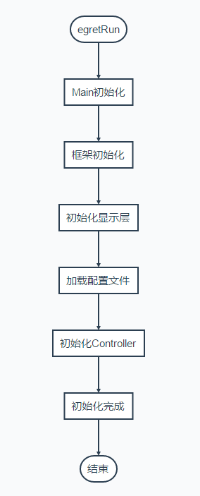
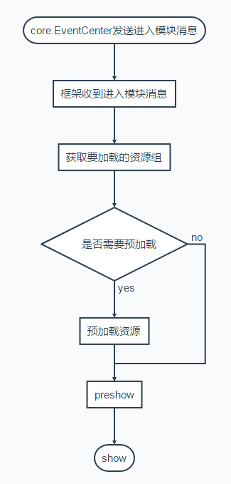
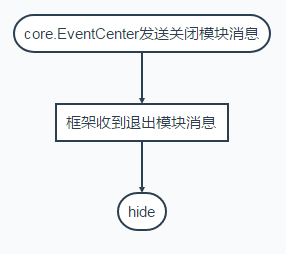

# 框架说明


## 目录

 1. [框架定位](#框架定位)
 2. [框架初始化流程](#框架初始化流程)
 3. [模块进入流程](#模块进入流程)
 4. [模块退出流程](#模块退出流程)
 5. [文件结构](#文件结构)
 6. [君子约定](#君子约定)
 7. [Egret相关](#Egret相关)
 8. [待办事宜](#待办事宜)
 9. [代码示例](#代码示例)
 10. [Lisence](#Lisence)

## 框架定位：
> 「让做游戏变简单！」

本框架定位于简化游戏流程，提高团队开发效率，目前提供了管理模块间关系，处理底层事务，及松散的工具集合，使开发者专注于游戏本身的逻辑。

## 框架初始化流程：
<p align="center">
    
</p>


## 模块进入流程：
<p align="center">
    
</p>

## 模块退出流程：
<p align="center">
    
</p>

## 文件结构：
+ src
    + core                              框架源代码目录
        + com
            + Animation.ts 				动画类
            + Component.ts				显示对象基类
            + EUIComponent.ts			EUI显示对象基类
            + EUILayer.ts				EUI显示层基类
            + Layer.ts					显示层基类
        + data
            + Callback.ts				回调函数对象
            + Dictionary.ts				字典对象
            + Node.ts					链表节点对象
            + NodeList.ts				链表对象
        + enum 
            + Keyboard.ts               键盘按键枚举
        + event
            + EventData.ts				事件数据基类
            + EventID.ts				事件ID类
            + KeyboardEventData.ts		键盘事件数据
            + ModuleEventData.ts		模块事件数据
        + interface
            + IComponent.ts		
            + IFactory.ts 		
            + ILoadingUI.ts
            + IMessage.ts
        + net
            + ByteBuffer.ts				二进制处理类
            + HttpAPI.ts				HTTP协议接口类
            + MessageData.ts			消息体封装
            + ProtoFactory.ts           ProtoBuff的二次封装
            + SocketAPI.ts				Websocket协议接口类
        + utils
            + Base64.ts					Base64实现
            + CachePool.ts				对象池
            + DateUtils.ts				日期工具
            + DBFactory.ts				龙骨工具
            + DebugUtils.ts				调试工具
            + Long.ts					Long结构实现
            + MathUtils.ts				数学计算
            + MCFactory.ts				egret.MovieClip工具
            + MD5.ts					MD5实现
            + PlatUtils.ts				平台判断
            + ResUtils.ts				RES封装
            + SoundUtils.ts				egret.Sound封装
            + TextUtils.ts				文本处理工具
            + WebUtils.ts				web相关处理工具
            + XMLUtils.ts				XML相关处理
        + Control.ts					模块基类
        + Core.ts						框架入口
        + EventCenter.ts				事件管理类
        + FrameEventCenter.ts			帧循环管理类
        + InputManager.ts			    输入控制类
        + LayerCenter.ts				层管理类
        + LoadingManager.ts             Loading管理类
        + TimerManager.ts				Timer管理类
    + game                              游戏源代码目录
+ resource                              游戏资源目录
    + assets
    + skins
+ thirdparty                            第三方库目录
    + jszip
    + protobuf

## 君子约定：
1.  类文件及类名统一首字母大写，文件名不宜过长，尽量在单个文件内写一个类，只有当前类引用的类和枚举可以写在同一文件内
2.  资源文件统一小写
3.  给接口名称加上大写字母I做为前缀，表示该类型为接口类型
4.	成员变量以m_开头
5.	私有静态变量以s_开头
6.	临时变量以t_开头
7.  常量及静态公共变量所有单词大写

## Egret相关：
1.	通过FrameEventCenter替代帧循环监听
2.	通过TimerManager替代new Timer
3.	尽量用序列帧代替透明度渐变及遮罩实现的动画
4.	少用get、set语法糖，如需使用子类在调用父类的get、set需采用egret自身封装的方法
5.	图片资源尽量合并为大图
6.	文本文件采用zip压缩
7.	常用UI面板关闭时尽量缓存
8.	减少频繁的实例化，请使用对象池
9.	在适当的时候销毁实例化对象及Resource加载的资源
10.	根据变量的使用频率决定它是否为临时变量
11.	注意UI与逻辑分离，逻辑与数据分离，
12.	谨慎的选择需要使用的容器类型，显示类尽量从Component和EUIComponent继承

## 待办事宜：
- [X] 为进行中
- [ ] 为未开始
***********************************
- [X] 完成HTTPAPI和SocketAPI、SoundUtils
- [ ] 添加EventCenter分块管理
- [ ] 常用UI组件的开发
- [ ] 基本配置表模版及相关工具的开发
- [ ] 修复框架中的BUG

## 代码示例：

# Main.ts
```javascript
class Main extends core.EUILayer {

    protected createChildren(): void {
        super.createChildren();
        //debug等级
        egret.Logger.logLevel = egret.Logger.OFF;
        //初始化框架
        core.Core.run(this.stage);
        //初始化层
        core.LayerCenter.getInstance().addLayer(LayerEnum.MAP_BG, new TileLayer());
        core.LayerCenter.getInstance().addLayer(LayerEnum.MAP_EFFECT, new core.Layer());
        core.LayerCenter.getInstance().addLayer(LayerEnum.MAP_GOODS, new core.Layer());
        core.LayerCenter.getInstance().addLayer(LayerEnum.MAP_ROLE, new core.Layer());
        core.LayerCenter.getInstance().addLayer(LayerEnum.MAP_TOP, new core.Layer());
        core.LayerCenter.getInstance().addLayer(LayerEnum.UI, new core.EUILayer());
        core.LayerCenter.getInstance().addLayer(LayerEnum.POPUP, new core.Layer());
        core.LayerCenter.getInstance().addLayer(LayerEnum.MENU, new core.Layer());
        core.LayerCenter.getInstance().addLayer(LayerEnum.LOADING, new core.EUILayer());
        core.LayerCenter.getInstance().addLayer(LayerEnum.HINT, new core.Layer());
        core.LayerCenter.getInstance().addLayer(LayerEnum.HINTSEC, new core.Layer());
        core.LayerCenter.getInstance().addLayer(LayerEnum.TOP, new core.Layer());
        //Config loading process interface
        //显示预加载进度条
        core.LoadingManager.getLoading(PreLoadingUI).show();
        // initialize the Resource loading library
        //初始化Resource资源加载库
        RES.addEventListener(RES.ResourceEvent.CONFIG_COMPLETE, this.onConfigComplete, this);
        RES.loadConfig("resource/default.res.json", "resource/");
    }
    /**
     * 配置文件加载完成,开始预加载皮肤主题资源和preload资源组。
     * Loading of configuration file is complete, start to pre-load the theme configuration file and the preload resource group
     */
    private onConfigComplete(event: RES.ResourceEvent): void {
        RES.removeEventListener(RES.ResourceEvent.CONFIG_COMPLETE, this.onConfigComplete, this);

        let assetAdapter = new AssetAdapter();
        egret.registerImplementation("eui.IAssetAdapter", assetAdapter);
        egret.registerImplementation("eui.IThemeAdapter", new ThemeAdapter());

        //加载皮肤主题配置文件,可以手动修改这个文件。替换默认皮肤。
        let theme = new eui.Theme("resource/default.thm.json", this.stage);
        theme.addEventListener(eui.UIEvent.COMPLETE, this.onThemeLoadComplete, this);
        //加载preload资源组
        core.ResUtils.loadGroups(['preload'], this.onResourceProgress, this.onResourceLoadError, this.onResourceLoadComplete, this);
    }

    private isThemeLoadEnd: boolean = false;
    /**
     * 主题文件加载完成,开始预加载
     * Loading of theme configuration file is complete, start to pre-load the 
     */
    private onThemeLoadComplete(): void {
        this.isThemeLoadEnd = true;
        this.createScene();
    }
    private isResourceLoadEnd: boolean = false;

    private createScene() {
        if (this.isThemeLoadEnd && this.isResourceLoadEnd) {
            //设置当前loading，设置后模块的加载都会显示当前loading，如需自定义loading，请调用LoadingManager的getLoading方法
            core.LoadingManager.setCurLoading(MainLoadingUI);
            //初始化模块控制器
            this.initController();
            //通知Login模块打开
            core.EventCenter.getInstance().sendEvent(new core.ModuleEventData(core.EventID.MODULE_SHOW, ModuleEnum.LOGIN));
        }
    }

    /**
     * 资源组加载进度
     */
    private onResourceProgress(data: core.GroupData): void {
        core.LoadingManager.getLoading(PreLoadingUI).setProgress(data);
    }
    /**
     * 资源组加载出错
     * Resource group loading failed
     */
    private onResourceLoadError(data: core.GroupData): void {
        //TODO
        Log("Group:" + data.curGroup + " has failed to load");
    }
    /**
     * preload资源组加载完成
     */
    private onResourceLoadComplete(data: core.GroupData): void {
        if (data.curGroup == 'preload') {
            //隐藏预加载进度条
            core.LoadingManager.getLoading(PreLoadingUI).hide();
            //初始化配置表
            Config.init(RES.getRes('config_zip'));
            this.isResourceLoadEnd = true;
            this.createScene();
        }
    }
    /**
     * 初始化控制器
     */
    private initController(): void {
        new GameController();
        new LoginController();
        new MainController();
    }
}
```

# LoginController.ts
```javascript
class LoginController extends core.Control {
	public constructor() {
		super(ModuleEnum.LOGIN);
	}
	private m_pLoginUI: LoginUI;
	/**
	 * 预加载资源组
	 */
	protected getLoadGroup(data?: core.ModuleEventData): string[] {
		return ['soundUI', 'animUI'];
	}
	/**
	 * 显示
	 */
	protected show(data?: core.ModuleEventData): void {
		if (!this.m_pLoginUI) {
			let loginUI: LoginUI = new LoginUI();
			this.m_pLoginUI = loginUI;
		}
		core.LayerCenter.getInstance().getLayer(LayerEnum.UI).addChild(this.m_pLoginUI);
	}
	/**
	 * 隐藏
	 */
	protected hide(): void {
		if (this.m_pLoginUI && this.m_pLoginUI.parent) {
			this.m_pLoginUI.parent.removeChild(this.m_pLoginUI);
		}
		this.m_pLoginUI = null;
	}
	
	protected release(): void {
		super.release();
	}
}
```
## Lisence
[MIT][1]

[1]: http://opensource.org/licenses/mit-license.html